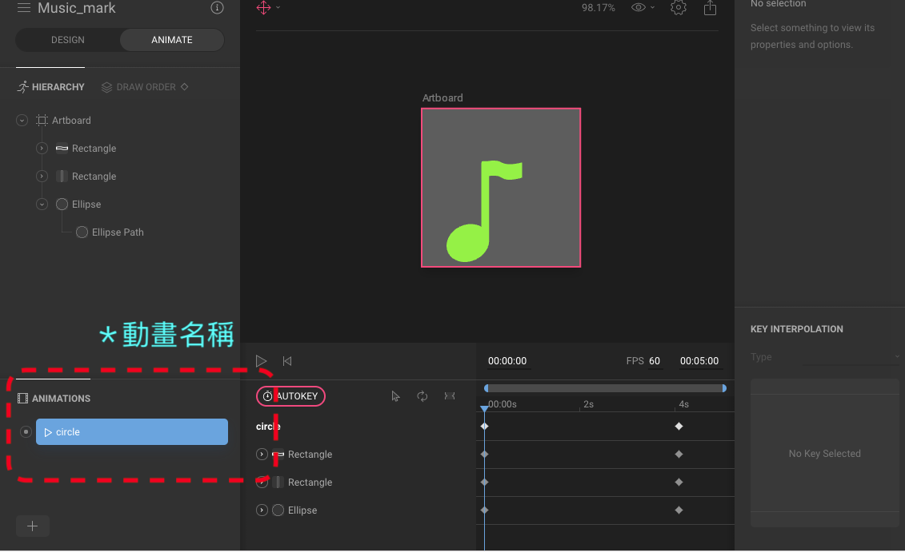

# Flare Tutorial
## [Flare](https://github.com/2d-inc/Flare-Flutter)   
Flare 提供開發者使用.flr檔案繪製向量圖形與視覺動畫，開發者可以藉由[2dimensions](https://www.2dimensions.com/)網站繪製圖形以及動畫，開發者在網站上可以選擇開放「免費」與私有「付費」，來隱藏Projects。

## 繪製 .flr 向量欓
a. 先進入[網站](https://www.2dimensions.com/a/tw00089923/files/flare/music-mark)

b. 將檔案 export

c. 存放檔案 
/project/assets/2d/file_name.flr2d

## 安裝 Flare Package
找到 Project/pubspec.yaml 下。

## 參考
1. [Flare github](https://github.com/2d-inc/Flare-Flutter)