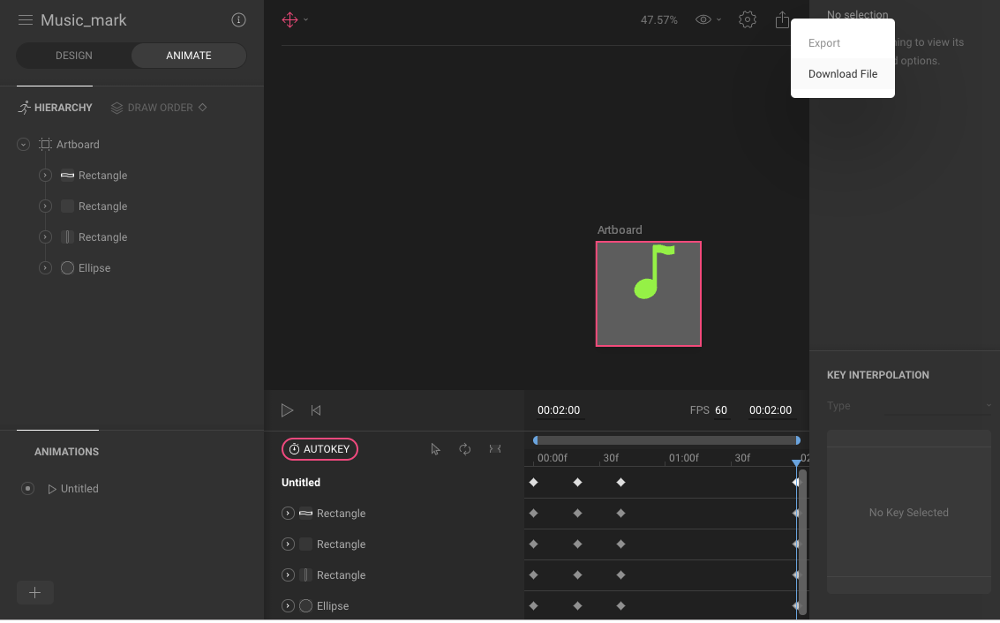

# Flare Tutorial
## [Flare](https://github.com/2d-inc/Flare-Flutter)   
  Flare 提供開發者使用.flr檔案繪製向量圖形與視覺動畫，開發者可以藉由[2dimensions](https://www.2dimensions.com/)網站繪製圖形以及動畫，開發者在網站上可以選擇開放「免費」與私有「付費」，付費來隱藏Projects。

## 繪製 .flr 向量檔
* a. 先進入[網站](https://www.2dimensions.com/a/tw00089923/files/flare/music-mark) 並繪製UI圖像


* b. 命稱動畫名稱


* c. 將檔案 export



* d. 存放檔案 

/project/assets/file_name.flr
** 注意： **路徑** 請確認正確。

## 安裝 Flare Package
找到 Project/pubspec.yaml 下。


```
import 'package:flare_flutter/flare_actor.dart';
class FlareActionBar extends StatelessWidget {
  @override
  Widget build(BuildContext context) {
    return Container(
      color: Colors.blueGrey,
      child: SizedBox(
        width: 200,
        height: 200,
        child: FlareActor(
          "assets/music_mark.flr",
          animation: "circle", // <- 動畫名稱
        ),
      ),
    );
  }
}
```

## 參考
1. [Flare github](https://github.com/2d-inc/Flare-Flutter)
2. [Flare example](https://github.com/2d-inc/Flare-Flutter/tree/master/example)